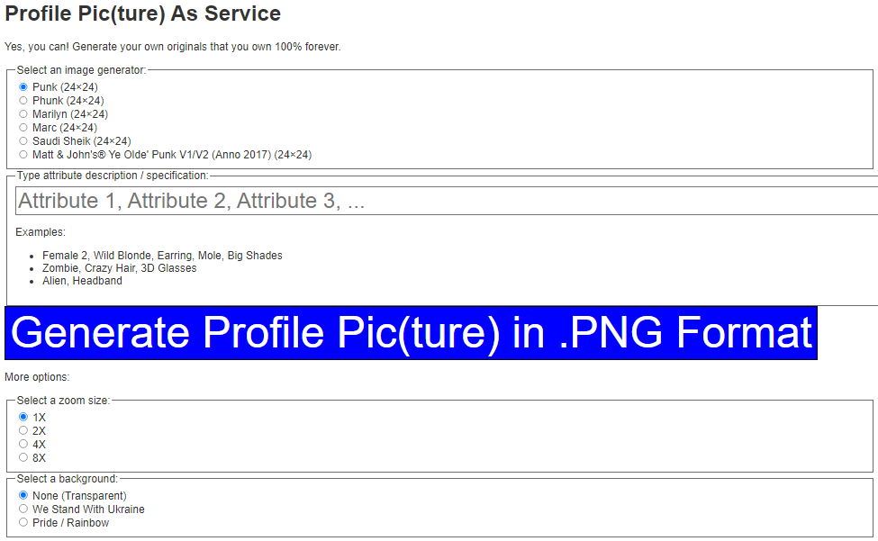

# Profile Pic(ture) As A Service


## Try Online

Try the sample profile pic(ture) as a service installation running online
at [**diypunkart.herokuapp.com »**](https://diypunkart.herokuapp.com/).





## Install & Run Online Using Heroku

Yes, you can. Run your own profile pic(ture) as a service
copy online using heroku.

Step 1 - Login to Heroku

```
$ heroku login
```

Step 2 - Create a Heroku app(lication)

```
$ heroku create  [app_name]
$ git push heroku master
```

That's it.
Test your profile pic(ture) as service
running at `https://[app_name].herokuapp.com`


## Install & Run "Offline" Via Local Loopback Service

See [**/profilepic  »**](profilepic)


## Questions? Comments?


Post them on the [D.I.Y. Punk (Pixel) Art reddit](https://old.reddit.com/r/DIYPunkArt). Thanks.
